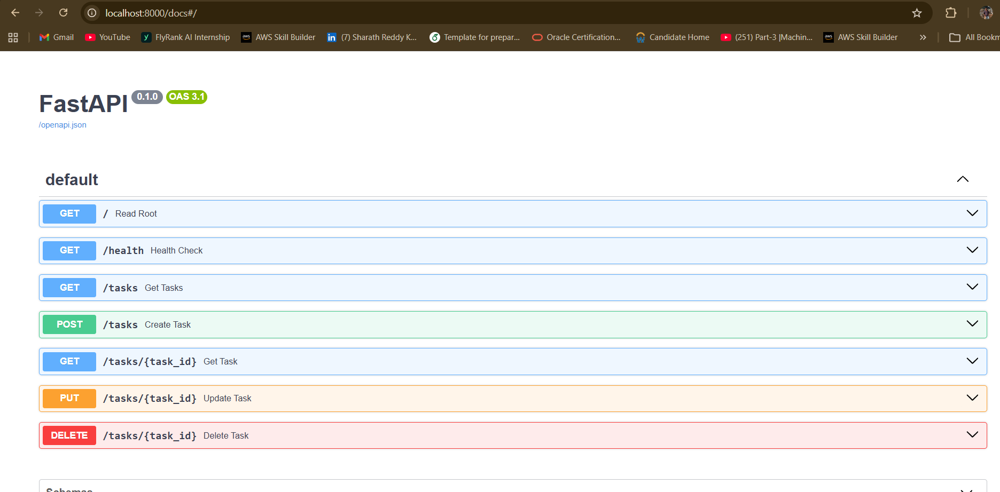

# Task API — CRUD with FastAPI

A small backend API for managing a to-do list. Supports the four CRUD operations — Create, Read, Update, Delete — on tasks stored in memory. Built as part of the FlyRank Internship, Backend Track, Week 2.

## Tech stack

- **Language:** Python 3.13
- **Framework:** FastAPI
- **Server:** Uvicorn
- **Storage:** In-memory list (no database — data resets on server restart)

## How to run it

1. Clone the repo:
   ```
   git clone https://github.com/sharathredddykondra/CRUD--FASTAPI-Project.git
   cd CRUD--FASTAPI-Project
   ```

2. Create and activate a virtual environment:
   ```
   python -m venv venv
   venv\Scripts\Activate.ps1
   ```

3. Install dependencies:
   ```
   pip install fastapi uvicorn
   ```

4. Run the server:
   ```
   uvicorn main:app --reload
   ```

5. Open your browser to `http://localhost:8000`

## Endpoints

| Method | Path | Description | Success | Error |
|---|---|---|---|---|
| GET | `/` | API info | 200 | — |
| GET | `/health` | Health check | 200 | — |
| GET | `/tasks` | List all tasks | 200 | — |
| GET | `/tasks/{id}` | Get one task | 200 | 404 if not found |
| POST | `/tasks` | Create a task | 201 | 400 if title missing/empty |
| PUT | `/tasks/{id}` | Update a task | 200 | 404 if not found, 400 if title empty |
| DELETE | `/tasks/{id}` | Delete a task | 204 | 404 if not found |

## Example request

```
PS C:\Users\shara\todo-api> curl.exe -i -X POST http://localhost:8000/tasks -H "Content-Type: application/json" -d '{"title":"Buy bread"}'
HTTP/1.1 201 Created
content-type: application/json

{"id":4,"title":"Buy bread","done":false}
```

## Swagger UI

Interactive API docs are available at `http://localhost:8000/docs`, generated automatically by FastAPI.



## The mortality experiment

Data is stored only in memory. Restarting the server (or saving a code change while running with `--reload`) wipes out any tasks created during that session and resets back to the original 3 seed tasks. This is expected — in-memory storage doesn't persist, which is exactly why a database gets introduced in Week 3.
